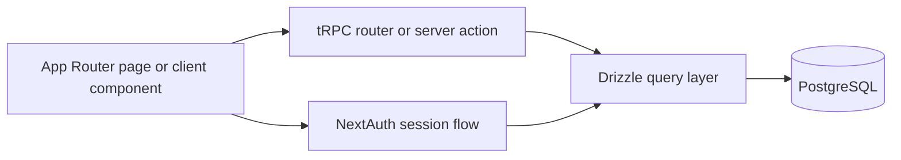

# Architecture

Kanban is built as a Next.js App Router application with a typed server boundary.

## Stack

- Next.js 15
- React 19
- TypeScript
- tRPC v11
- Drizzle ORM
- PostgreSQL
- NextAuth v5
- Tailwind CSS v4
- shadcn/ui and Radix UI
- React Hook Form, Zod, TanStack React Query, and Nuqs

## Application layers

- `src/app` handles routes, layouts, and page composition.
- `src/app/_components` contains shared UI pieces, dialogs, and board/task widgets.
- `src/server/api` exposes the tRPC routers for boards, columns, tasks, subtasks, auth, and supporting endpoints.
- `src/server/db` owns the database client and schema definitions.
- `src/server/auth` configures NextAuth providers, callbacks, and adapter wiring.
- `src/actions` contains server actions used by the app.
- `src/model` contains domain-facing TypeScript models.

## Request flow

## Design choices

- tRPC is used as the internal API layer to keep client and server types aligned.
- Drizzle is used for schema-first database access and type-safe queries.
- NextAuth centralizes credentials and OAuth sign-in flows.
- Soft delete is used in the kanban domain for boards, columns, tasks, and subtasks.
