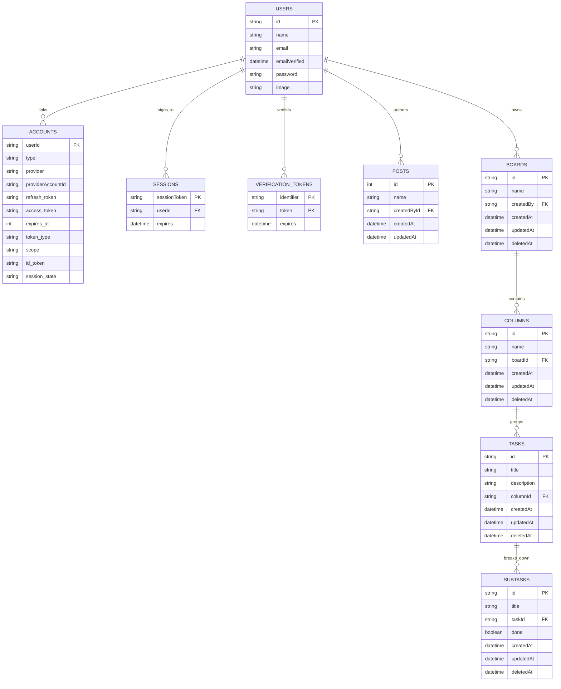

# Detailed Schema Diagram

```mermaid
erDiagram
    USERS {
        string id PK
        string name
        string email
        datetime emailVerified
        string password
        string image
    }

    ACCOUNTS {
        string userId FK
        string type
        string provider
        string providerAccountId
        string refresh_token
        string access_token
        int expires_at
        string token_type
        string scope
        string id_token
        string session_state
    }

    SESSIONS {
        string sessionToken PK
        string userId FK
        datetime expires
    }

    VERIFICATION_TOKENS {
        string identifier PK
        string token PK
        datetime expires
    }

    POSTS {
        int id PK
        string name
        string createdById FK
        datetime createdAt
        datetime updatedAt
    }

    BOARDS {
        string id PK
        string name
        string createdBy FK
        datetime createdAt
        datetime updatedAt
        datetime deletedAt
    }

    COLUMNS {
        string id PK
        string name
        string boardId FK
        datetime createdAt
        datetime updatedAt
        datetime deletedAt
    }

    TASKS {
        string id PK
        string title
        string description
        string columnId FK
        datetime createdAt
        datetime updatedAt
        datetime deletedAt
    }

    SUBTASKS {
        string id PK
        string title
        string taskId FK
        boolean done
        datetime createdAt
        datetime updatedAt
        datetime deletedAt
    }

    USERS ||--o{ ACCOUNTS : links
    USERS ||--o{ SESSIONS : signs_in
    USERS ||--o{ VERIFICATION_TOKENS : verifies
    USERS ||--o{ POSTS : authors
    USERS ||--o{ BOARDS : owns

    BOARDS ||--o{ COLUMNS : contains
    COLUMNS ||--o{ TASKS : groups
    TASKS ||--o{ SUBTASKS : breaks_down
```
