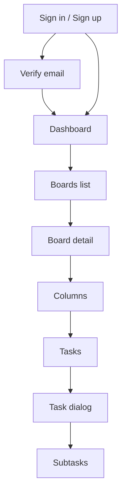

# Navigation Flow

## Reading the flow

- Authenticated users land in the dashboard.
- A board is the main container for the rest of the workflow.
- Columns group tasks visually.
- Tasks can be created, edited, viewed, and broken into subtasks.
